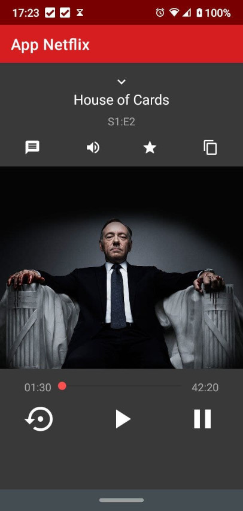

# App Netflix

## Table of contents

- [Introduction](#introduction)
- [Technical info](#technical-info)

  [Languages](#languages)

- [Credits](#credits)
- [Lincense](#license)

## Introduction

This app simulates the old Netflix player, mocking up the exhibition of the series House of Cards.

[//]: # "this is a workaround to make a comments"
[//]: # "## Features"
[//]: # "## Demo"

## Technical info

### Languages

 

## Credits

This app is one of the projects developed in the online course **Desenvolvimento Android Completo 2021 - Crie 18 Apps**, available at [Udemy](https://www.udemy.com/course/curso-de-desenvolvimento-android-oreo/).

## License

